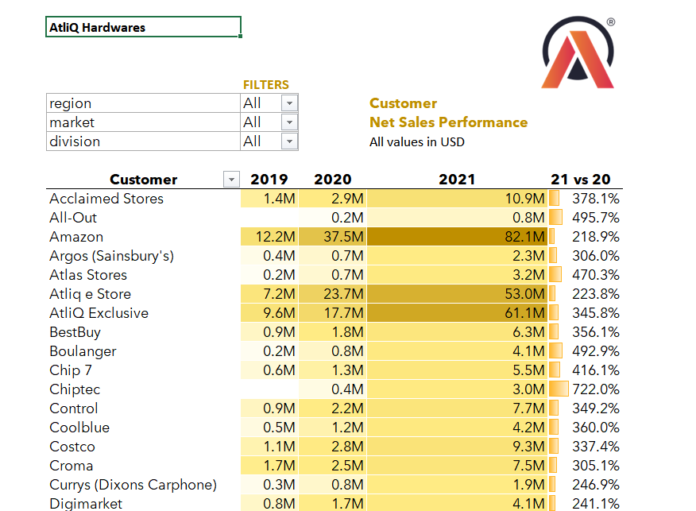
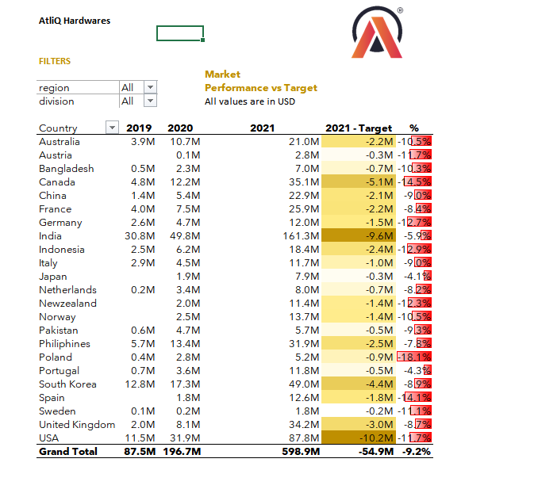

# AtliQ Hardware – Sales Analysis | Excel

## Project Overview

Created two Excel-based sales reports for the Sales Team to evaluate customer performance and understand market performance against targets.

The reports transform sales data into clear, actionable insights that can support better sales decisions, customer negotiations, and business growth.

## Business Objectives

- Evaluate customer-wise net sales performance across years.
- Understand market/country-level sales performance.
- Compare market performance against targets.
- Identify performance gaps and growth opportunities.
- Support customer discount and negotiation decisions.
- Identify promising markets for potential business expansion.

## Reports Created

### 1. Customer Performance Report

Provides a detailed view of net sales performance for each customer across multiple years.

It helps the Sales Team:
- Track customer-level sales trends.
- Compare year-wise performance.
- Identify high-performing customers.
- Spot customers with weaker or declining performance.
- Support data-driven customer discussions and sales strategies.

### 2. Market Performance vs Target Report

Provides a country-wise view of sales performance across multiple years and compares actual performance against the set target.

It helps stakeholders:
- Monitor market performance.
- Identify markets above or below target.
- Understand target variance and percentage difference.
- Recognize potential areas for improvement and business expansion.

## Tools & Techniques Used

- Microsoft Excel
- PivotTables
- Power Query
- DAX (Basics)
- Conditional Formatting
- Report Beautification
- Sales Domain Metrics

## Key Learnings

Through this project, I gained practical experience in transforming sales data into structured reports and using Excel analytics features to evaluate business performance.

The project strengthened my understanding of:
- Sales performance analysis
- Customer and market segmentation
- Target vs actual analysis
- Year-over-year performance comparison
- Business-focused data visualization
- Presenting insights in a clear and actionable format

## Business Value

These reports provide stakeholders with a structured view of customer and market performance, making it easier to identify performance gaps, recognize growth opportunities, and support informed sales decisions.

## Project Screenshots

## Customer Performance Report

## Market Performance vs Target Report

## Note

This project focuses on sales analysis and reporting using Excel. The workbook included in this repository contains the project reports.
